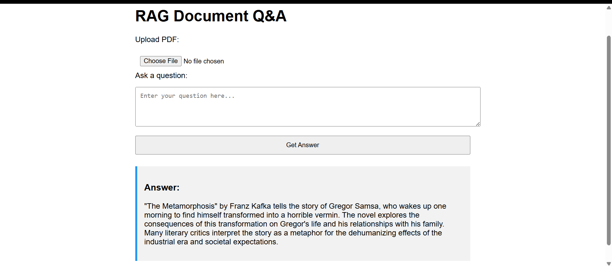
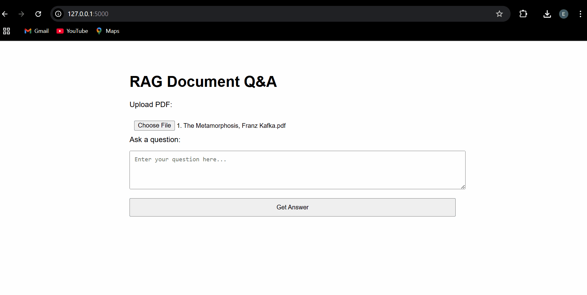

# 📚 Retrieval-Augmented Generation (RAG) Project

This project demonstrates a basic **Retrieval-Augmented Generation (RAG)** setup using Franz Kafka's *The Metamorphosis* as the source document. It retrieves context-relevant passages from the text and provides AI-generated answers using a language model.

## 📦 Features

- Load and process PDF files into chunks
- Semantic search over document content
- Answer questions based on retrieved chunks
- Support for file-based document evaluation

---

## 🗂️ Project Structure

```
.
├── app.py                   # Flask application
├── rag.py                   # Core logic for embedding, retrieval, and generation
├── templates/
│   └── index.html           # Web UI
├── uploads/                 # Uploaded PDF files
├── data/
│   └── The Metamorphosis, Franz Kafka.pdf
├── .env                     # Environment variables
├── requirements.txt
└── README.md
```

---

## 🔧 Setup Instructions

### 1. Clone the Repository

```bash
git clone https://github.com/esha-nasar/rag-doc.git
```

### 2. Create a Virtual Environment (Optional but Recommended)

```bash
python -m venv venv
source venv/bin/activate  # On Windows: venv\Scripts\activate
```

### 3. Install Dependencies

```bash
pip install -r requirements.txt
```

### 4. Add Your OpenAI API Key

Create a `.env` file in the root directory and add:

```env
OPENAI_API_KEY=your-api-key-here
```

### 5. Run the Application

```bash
python app.py
```

Then open your browser and go to:  
📍 `http://127.0.0.1:5000`

---

## 📄 Sample `.env` File

```env
OPENAI_API_KEY=sk-xxxxxxxxxxxxxxxxxxxxxxxxxxxxxxxxxxxxxxxx
```
---

## 📘 Sample Document

- **Title**: The Metamorphosis  
- **Author**: Franz Kafka  
- **Summary**: A surreal story of a salesman, Gregor Samsa, who wakes up to find himself transformed into a giant insect. The novella explores themes of isolation, identity, and societal rejection.

---

## ❓ Sample Questions for Testing

Try asking the following:

1. Who is Gregor Samsa and what happens to him?
2. What kind of work did Gregor do before his transformation?
3. How does Gregor’s family react to his metamorphosis?
4. What is the symbolic meaning of Gregor turning into an insect?
5. Describe the opening scene of the book.
6. Why does Gregor struggle to get out of bed?
7. What is Kafka criticizing in this novella?
8. How does Gregor’s relationship with his father evolve?
9. What role does isolation play in Gregor’s story?
10. How does the story end?

---

## 🤖 How It Works

1. **Chunking**: The document is split into small, meaningful sections.
2. **Embedding**: Chunks are converted to embeddings using OpenAI.
3. **Retrieval**: When a question is asked, the system fetches the most relevant chunks.
4. **Generation**: GPT generates a natural language answer using retrieved context.

---

## 📥 Download the Sample PDF

- [The Metamorphosis - Franz Kafka (from InfoBooks.org)](https://www.infobooks.org/pdfview/the-metamorphosis-franz-kafka-169/)

---

## 🖼️ Demo


---


---

## 🧠 License

This project is intended for personal use.
